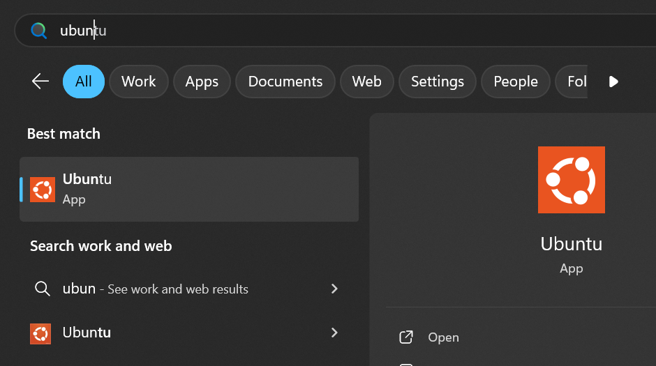

# Ansible Lab Setup Guide

This guide provides step-by-step instructions to set up Ansible on Windows using WSL2 and use it to deploy an Azure Virtual Machine.

---

## Step 1 - Enable WSL2 on Windows

Run the following commands in PowerShell to install and configure WSL2:

```sh
wsl --install                # Install WSL environment
wsl --install -d Ubuntu      # Install Ubuntu Linux on WSL
wsl --list                   # List the installed distributions
```

Once installed, open Ubuntu by searching for it in the Start menu:



During the first launch, you will be prompted to create a username and password.

For more details, refer to the official [WSL installation guide](https://learn.microsoft.com/en-us/windows/wsl/install).

---

## Step 2 - Install and Configure Ansible on WSL Ubuntu

### Install Python and pip

```sh
sudo apt update
sudo apt install -y python3 python3-pip
```

### Create a Python Virtual Environment

```sh
mkdir -p ~/lab/ansible/
python3 -m venv ~/lab/ansible/ansible-azure
source ~/lab/ansible/ansible-azure/bin/activate
```

### Verify Virtual Environment Activation

```sh
which python3
```
**Expected output:**
```
/home/<user>/lab/ansible/ansible-azure/bin/python3
```

### Install Ansible

```sh
python3 -m pip install ansible-core
```

### Install Azure Modules for Ansible

```sh
python3 -m pip install azure-cli

ansible-galaxy collection install azure.azcollection --force
python3 -m pip install -r ~/.ansible/collections/ansible_collections/azure/azcollection/requirements.txt
```

### Validate Azure Module Installation

```sh
python3 -c "import azure; print('Azure module is installed')"
```

---

## Step 3 - Deploy an Azure Virtual Machine Using Ansible

### Clone the Lab Repository

```sh
git clone git@github.com:dhaneshu/Ansible-Lab.git
cd Ansible-Lab
```

### Log in to Azure and Set the Default Subscription

```sh
az login
```

### Generate an SSH Key Pair

```sh
ssh-keygen -m PEM -t rsa -b 4096
```
Press **Enter** for all prompts to accept the default settings.

### Get Your Public IP Address

```sh
curl ifconfig.me
```

### Update `vars.yaml` with Your Inputs

Modify the `vars.yaml` file with the required details before running the playbook.

### Run the Ansible Playbook

```sh
ansible-playbook azurevm.yaml -e "@vars.yaml"
```

---

## Conclusion

You have now set up Ansible on WSL2 and deployed an Azure VM using an Ansible playbook. You can modify the playbook to deploy additional resources as needed.

For troubleshooting or additional configurations, refer to the [Ansible documentation](https://docs.ansible.com/ansible/latest/).

Happy Automation! 🚀

